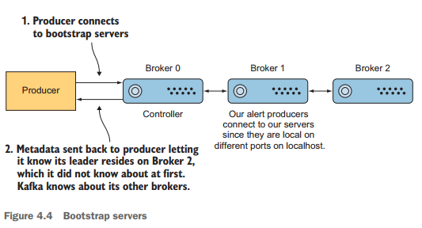
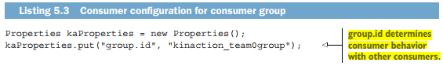
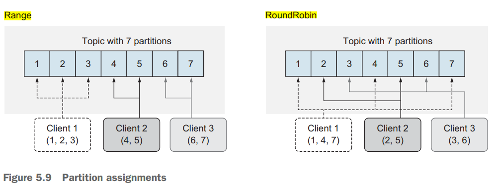

# [Pág. 41] Parte 2: Aplicando Kafka

# [Pág. 43] Diseño de un proyecto Kafka

---

En nuestro capítulo anterior, vimos cómo podemos trabajar con Kafka desde la línea de comandos y cómo usar un cliente Java. Ahora, ampliaremos esos primeros conceptos y analizaremos el diseño de varias soluciones con Kafka. Discutiremos algunas preguntas a considerar mientras diseñamos una estrategia para el proyecto de ejemplo que comenzaremos en este capítulo.

## [Pág. 44] Diseñar un proyecto kafka

Aunque las nuevas empresas y proyectos pueden utilizar Kafka al empezar, ese no es el caso para todos los que adoptan Kafka. Para aquellos de nosotros que hemos estado en entornos empresariales o trabajado con sistemas heredados, en realidad, comenzar desde cero no es un lujo que siempre tengamos. En este capítulo, trabajaremos en un proyecto para una empresa que está lista para cambiar su forma actual de manejar datos y aplicar este nuevo martillo llamado Kafka.

## [Pág. 44] Tomar el control de una arquitectura de datos existentes

Nuestra nueva empresa de consultoría ficticia acaba de ganar un contrato para ayudar a rediseñar una planta que funciona con bicicletas eléctricas y las gestiona de forma remota. Hay sensores colocados en toda la bicicleta que proporcionan continuamente eventos sobre la condición y el estado del equipo interno que están monitoreando. Sin embargo, se generan tantos eventos que el sistema actual ignora la mayoría de los mensajes. Se nos ha pedido que ayudemos a los propietarios del sitio a desbloquear el potencial de esos datos para que los utilicen sus diversas aplicaciones. Además de esto, nuestros datos actuales incluyen sistemas de bases de datos relacionales tradicionales que son grandes y agrupados. Con tantos sensores y una base de datos existente, **¿cómo podríamos crear nuestra nueva arquitectura basada en Kafka sin afectar la fabricación?**

## [Pág. 44] Un primer cambio

Una de las mejores formas de comenzar nuestra tarea probablemente no sea con un enfoque radical: no es necesario que todos nuestros datos se trasladen a Kafka a la vez. Si usamos una base de datos hoy y queremos aprovechar la transmisión de datos mañana, una de las rampas de acceso más fáciles comienza con Kafka Connect. Aunque puede manejar cargas de producción, no es necesario hacerlo desde el principio. Tomaremos una tabla de base de datos y comenzaremos nuestra nueva arquitectura mientras dejamos que las aplicaciones existentes se ejecuten por el momento. Pero primero, veamos algunos ejemplos para familiarizarnos con Kafka Connect.

## [Pág. 44] Funciones integradas

En nuestro ejemplo, **tomaremos datos de una fuente de datos y los colocaremos en Kafka para que podamos tratar los datos como si provinieran de un archivo Kafka.** Usando el archivo `connect-filesource.properties` como plantilla, que viene incluido en su instalación de Kafka `C:\kafka_2.13-3.7.0\config`, creemos un archivo llamado `alert-source.properties` y coloquemos las mismas propiedades que vienen en el archivo `connect-filesource.properties`.

Nuestro archivo definirá las configuraciones que necesitamos para configurar el archivo `alert.txt` y especificar los datos que se enviarán al `topic` específico `kinaction-alert-connect`.

Con configuraciones (y no código), podemos obtener datos en Kafka desde cualquier archivo. Dado que leer un archivo es una tarea común, podemos utilizar las clases prediseñadas de Connect. En este caso, la clase es `FileStreamSource`. Para el siguiente listado, supongamos que tenemos una aplicación que envía alertas a un archivo de texto.

```properties
# Archivo creado como parte del ejemplo del libro Kafka In Action 2020
# Desarrollador Martín
#
name=alert-source
connector.class=FileStreamSource
tasks.max=1
file=alert.txt
topic=kinaction-alert-connect
```

El valor de la propiedad `topic` es significativo. Lo usaremos más adelante para verificar que los mensajes se extraigan de un archivo al topic específico `kinaction-alert-connect`. El archivo `alert.txt` se monitorea para detectar cambios a medida que llegan nuevos mensajes. Y finalmente, elegimos `1` para el valor de `task.max` porque realmente solo necesitamos una tarea para nuestro conector y, en este ejemplo, no nos preocupa el paralelismo.

**NOTA** 
> Si está ejecutando ZooKeeper y Kafka localmente, asegúrese de tener sus propios agentes Kafka todavía ejecutándose como parte de este ejercicio (en caso de que los cierre después del capítulo anterior).

Ahora que hemos realizado la configuración necesaria, debemos `iniciar Connect` y enviar nuestras configuraciones. Podemos iniciar el proceso de conexión invocando el script de shell `connect-standalone.sh`, incluido nuestro archivo de configuración personalizado como parámetro de ese script. **Para iniciar Connect en una terminal, ejecute el comando en la siguiente lista y déjelo funcionando.*

```bash
C:\kafka_2.13-3.7.0
$ .\bin\windows\connect-standalone.bat .\config\connect-standalone.properties .\config\alert-source.properties

[2024-04-23 18:30:22,446] INFO Kafka Connect worker initializing ... (org.apache.kafka.connect.cli.AbstractConnectCli:114)
...
[2024-04-23 18:30:27,059] INFO [alert-source|task-0] Kafka version: 3.7.0 (org.apache.kafka.common.utils.AppInfoParser:124)
[2024-04-23 18:30:27,060] INFO [alert-source|task-0] Kafka commitId: 2ae524ed625438c5 (org.apache.kafka.common.utils.AppInfoParser:125)
[2024-04-23 18:30:27,061] INFO [alert-source|task-0] Kafka startTimeMs: 1713915027059 (org.apache.kafka.common.utils.AppInfoParser:126)
[2024-04-23 18:30:27,074] INFO [alert-source|task-0] [Producer clientId=connector-producer-alert-source-0] Cluster ID: 1ARk35xQSYKGDKNSEQt8BA (org.apache.kafka.clients.Metadata:349)
[2024-04-23 18:30:27,080] INFO [alert-source|task-0] AbstractConfig values:
        batch.size = 2000
        file = alert.txt
        topic = kinaction-alert-connect
 (org.apache.kafka.common.config.AbstractConfig:370)
[2024-04-23 18:30:27,080] INFO Created connector alert-source (org.apache.kafka.connect.cli.ConnectStandalone:87)
[2024-04-23 18:30:27,082] INFO [alert-source|task-0] WorkerSourceTask{id=alert-source-0} Source task finished initialization and start (org.apache.kafka.connect.runtime.AbstractWorkerSourceTask:281)
```

> Notar que el `.\config\alert-source.properties` es el archivo que creamos anterioremente.

Pasando a otra ventana de terminal, cree un archivo de texto llamado `alert.txt` en el directorio raíz de la instalación de Kafka y agregue un par de líneas de texto a este archivo usando su editor de texto; el texto puede ser lo que quiera. Ahora usemos el comando `console-consumer` para verificar que Connect esté haciendo su trabajo. Para eso, abriremos otra ventana de terminal y consumiremos del tema `kinaction-alert-connect`, usando la siguiente lista como ejemplo. Connect debería ingerir el contenido de este archivo `alert.txt` y producir los datos en Kafka.

```bash
C:\kafka_2.13-3.7.0
$ .\bin\windows\kafka-console-consumer.bat --topic kinaction-alert-connect --from-beginning --bootstrap-server localhost:9092
{"schema":{"type":"string","optional":false},"payload":"escribiendo desde notepad"}
```

# [Pág. 66] Producer: Datos de abastecimiento

## Opciones de productor

El productor trabaja solo desde la configuración para recuperar gran parte de la información que necesita, como una lista de todos nuestros `brokers Kafka`. Utilizando el valor de la propiedad `bootstrap.servers` como punto de partida, el productor obtiene metadatos sobre `brokers` y `particiones` que utiliza para todas las escrituras posteriores.

Kafka le permite cambiar comportamientos clave simplemente cambiando algunos valores de configuración. Una forma de lidiar con todos los nombres de las claves de configuración del productor es usar las constantes proporcionadas en la clase Java `ProducerConfig` al desarrollar el código del productor y buscar la etiqueta de Importancia de "high" en el sitio web de Confluent. Sin embargo, en nuestros ejemplos, usaremos los nombres de las propiedades para mayor claridad.

La `Tabla 4.1` enumera algunas de las configuraciones de productores más importantes que respaldan nuestros ejemplos específicos.

`Table 4.1 Important producer configurations`
| Key                   | Purpose                                                                                               |
|-----------------------|-------------------------------------------------------------------------------------------------------|
| aks                   | Número de réplicas de acuses de recibo que requiere un productor antes de establecer el éxito.        |
| bootstrap.servers     | Uno o más brokers de Kafka para conectarse para iniciar.                                              |
| value.serializer      | La clase que se utiliza para la serialización del valor.                                              |
| key.serializer        | La clase que se utiliza para la serialización de la clave.                                            |


## Configurar la lista de brokers

De nuestros ejemplos de cómo escribir mensajes a Kafka, queda claro que tenemos que decirle al productor a qué tema enviar mensajes. Recuerde que **los temas se componen de particiones**, pero **¿cómo sabe Kafka dónde reside una partición de tema?** Sin embargo, no es necesario que conozcamos los detalles de esas particiones cuando enviamos mensajes. Quizás un ejemplo ayude a aclarar este enigma. Una de las opciones de configuración requeridas para los productores es bootstrap.servers. `La Figura 4.4` muestra un ejemplo de un productor que solo tiene el `broker 0` en su lista de servidores de arranque, pero podrá conocer los tres `brokers` del clúster comenzando solo con uno.

La propiedad `bootstrap.servers` puede aceptar varios brokers iniciales o sólo uno, como se muestra en la figura 4.4. Al conectarse a este corredor, el cliente puede descubrir los metadatos que necesita, que también incluyen datos sobre otros corredores en el clúster.



Esta configuración es clave para ayudar al productor a encontrar un corredor con quien hablar. Una vez que el productor está conectado al clúster, puede obtener los metadatos que necesita para obtener los detalles (como dónde reside la réplica líder de la partición en el disco) que no proporcionamos anteriormente. Los clientes productores también pueden superar una falla del líder de partición en el que escriben utilizando la información sobre el clúster para encontrar un nuevo líder. Es posible que hayas notado que la información de ZooKeeper no forma parte de la configuración. Cualquier metadato que el productor necesite se manejará sin que el cliente productor tenga que proporcionar detalles del clúster ZooKeeper.

# [Pág. 87] Consumers: Desbloqueo de datos

## Opciones de consumidor

Siempre necesitamos conocer los brokers a los que podemos intentar conectarnos al iniciar el cliente. Un pequeño problema es asegurarse de utilizar los deserializadores para las claves y valores que coincidan con los serializadores con los que produjo el mensaje. *Por ejemplo, si produce usando `StringSerializer` pero intenta consumir usando `LongDeSerializer`, obtendrá una excepción que deberá corregir.*

La `Tabla 5.1` enumera algunos de los valores de configuración que debemos conocer cuando comenzamos a escribir nuestros propios consumidores.

`Table 5.1 Consumer configuration`
| Key                   | Purpose                                                                            |
|-----------------------|------------------------------------------------------------------------------------|
| bootstrap.servers     | Uno o más brokers de Kafka para conectarse para iniciar.                           |
| value.deserializer    | Necesario para la deserialización del valor.                                       |
| key.deserializer      | Necesario para la deserialización de la clave.                                     |
| group.id              | Un nombre que se utiliza para unirse a un grupo de consumidores.                   |
| client.id             | Una identificación para identificar a un usuario (la usaremos en el capítulo 10).  |
| heartbeat.interval.ms | Intervalo para los pings del consumidor al coordinador del grupo                   |

Una forma de lidiar con todos los nombres de las claves de configuración del consumidor es usar las constantes proporcionadas en la clase Java `ConsumerConfig` y buscar la etiqueta de Importancia `"high"` en el sitio web de Confluent. Sin embargo, en nuestros ejemplos, usaremos los nombres de las propiedades para mayor claridad. El `listado 5.1` muestra cuatro de estas claves en acción. **Los valores para las configuraciones en la tabla 5.1 determinan cómo nuestro consumidor interactúa con los brokers y con otros consumidores.**

## Cómo interactúan los consumidores

**¿Por qué es primordial el concepto de grupos de consumidores?** Probablemente la razón más importante es que el escalamiento se ve afectado por la adición o eliminación de clientes de un grupo. Los consumidores que no forman parte del mismo grupo no comparten la misma coordinación de conocimientos sobre compensación.

El `Listado 5.3 `muestra un ejemplo de un grupo llamado `kinaction_team0group`. Si, en cambio, crea un nuevo `group.id` (como un GUID aleatorio), iniciará un nuevo consumidor sin compensaciones almacenadas y sin otros consumidores en su grupo. Si se une a un grupo existente (o uno que ya tenía compensaciones almacenadas), su consumidor puede compartir el trabajo con otros o incluso puede continuar donde dejó la lectura de ejecuciones anteriores.



A menudo ocurre que muchos consumidores leen sobre el mismo topic. Un detalle importante para decidir si necesita una nueva ID de grupo es si sus consumidores están trabajando como parte de una aplicación o como flujos lógicos separados.

Se considerará que **cada consumidor que utiliza el mismo `group.id` que otro consumidor está trabajando en conjunto** para consumir las particiones y los offsets del topic como una aplicación lógica.

## Coordinadores de grupo

**Como regla general, sólo un consumidor por grupo de consumidores puede leer una partición.** En otras palabras, mientras que muchos consumidores pueden leer una partición, **solo puede leerla un consumidor de cada grupo a la vez.**

## Estrategia de asignación de particiones

Un elemento que debemos tener en cuenta es cómo se asignan los consumidores a las particiones. Esto es importante porque le ayudará a determinar cuántas particiones podría estar sujeto a impuestos por el procesamiento de cada uno de sus consumidores. La propiedad `partición.assignment.strategy` es la que determina qué particiones se asignan a cada consumidor. Se proporcionan `Range` y `RoundRobin`, al igual que `Sticky` y `CooperativeSticky`.

El asignador de `rango` utiliza un solo topic para encontrar el número de particiones (ordenadas por número) y luego lo desglosa por el número de consumidores. Si la división no es uniforme, entonces los primeros consumidores (usando el orden alfabético) obtienen las particiones restantes. Asegúrese de emplear una variedad de particiones que sus consumidores puedan manejar y considere cambiar la estrategia de asignación si algunos clientes consumidores usan todos sus recursos, aunque otros están bien. La `Figura 5.9` muestra cómo tres clientes tomarán tres de siete particiones en total y terminarán con más particiones que el último cliente.

La estrategia de operación por turnos `(round-robin)` es donde las particiones se distribuyen uniformemente en la fila de consumidores. La `Figura 5.9` muestra un ejemplo de tres clientes que forman parte del mismo grupo de consumidores y **se asignan en forma circular** para un tema compuesto por siete particiones. El primer consumidor obtiene la primera partición, el segundo consumidor la segunda, y así sucesivamente hasta que se agoten las particiones.

