# Kafka en acción

Tomado del libro **Kafka In Action (2022)** de los autores **Dylan Scott, Viktor Gamov y Dave Klein**

**Referencias**

- [Un programador nace (youtube) - Spring Boot con Apache Kafka - Guía completa #spring #kafka](https://github.com/magadiflo/spring-boot-for-apache-kafka)
- [Bouali Ali (youtube) Apache Kafka Tutorial with Spring Boot Reactive & WebFlux | Kafka Tutorial](https://github.com/magadiflo/spring-boot-apache-kafka)
- [Amigoscode (youtube) - Kafka Tutorial - Spring Boot Microservices](https://github.com/magadiflo/spring-boot-kafka)
- Usando Kafka en Docker: [Uncle Dave's Code (youtube) - Creando una Aplicación Escalable - Microservicios con Spring Boot](https://github.com/magadiflo/microservices)

---

# [Pág. 3] Introducción a Kafka

## [Pág. 4] ¿Qué es Kafka?

El sitio web de `Apache Kafka` define Kafka como  una plataforma de streaming distribuido. Tiene tres capacidades principales.

- Lectura y escritura de registros como una cola de mensaje.
- Almacenamiento de registros con tolerancia a fallos.
- Procesamiento de flujos a medida que se producen.

Al igual que otras plataformas de mensajería, `Kafka actúa` (en términos reduccionistas) como un `intermediario` para los datos que entran en el sistema **(de los productores)** y salen del sistema **(para los consumidores o usuarios finales)**. El acoplamiento flexible se consigue permitiendo esta separación entre el productor y el usuario final del mensaje. `El productor puede enviar el mensaje que quiera sin saber si alguien está suscrito.` Además, `Kafka` tiene varias formas de entregar mensajes para adaptarse a su caso de negocio. La entrega de mensajes de Kafka puede adoptar al menos los siguientes tres métodos de entrega:

- `Semántica At-least-once (al menos una vez)`: se envía un mensaje según sea necesario hasta que se confirma.

- `Semántica At-most-once (como máximo una vez)`: un mensaje sólo se envía una vez y no se reenvía en caso de fallo.

- `Semántica Exactly-once (exactamente una vez)`: un mensaje sólo es visto una vez por el consumidor del mensaje. 

### Semántica At-least-once (al menos una vez)

Veamos qué significan estas opciones de mensajería. Veamos la semántica "al menos una vez" (figura 1.3). En este caso, Kafka puede configurarse para permitir a un productor de mensajes enviar el mismo mensaje más de una vez y que se escriba en los intermediarios. Si un mensaje no recibe la garantía de que ha sido escrito en el broker, el productor puede reenviar el mensaje [3]. Para aquellos casos en los que no se puede perder un mensaje, por ejemplo que alguien haya pagado una factura, esta garantía puede requerir algún filtro por parte del consumidor, pero es uno de los métodos de entrega más seguros.

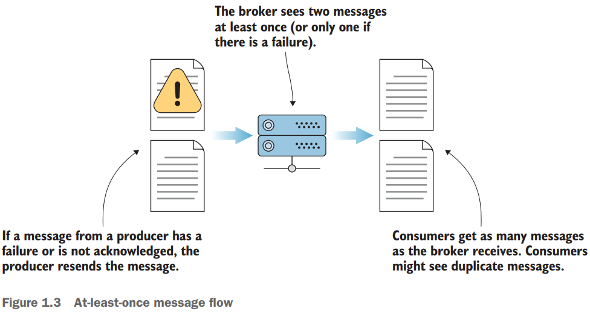

### Semántica At-most-once (como máximo una vez)

La semántica At-most-once (figura 1.4) se da cuando un productor de mensajes puede enviar un mensaje una vez y no volver a intentarlo. En caso de fallo, el productor sigue adelante y no intenta enviarlo de nuevo [3]. ¿Por qué alguien estaría de acuerdo con perder un mensaje? Si un sitio web muy visitado realiza un seguimiento de las páginas vistas por sus visitantes, puede que le parezca bien perder algunos eventos de páginas vistas de los millones que procesa cada día. Mantener el sistema funcionando y no esperar reconocimientos puede compensar cualquier costo de pérdida de datos.

Kafka añadió la semántica exactly-once, también conocida como EOS, a su conjunto de características en la versión 0.11.0. EOS generó un gran debate con su lanzamiento [3]. Por un lado, la semántica "exactamente una vez" (figura 1.5) es ideal para muchos casos de uso. Parecía una garantía lógica para eliminar los mensajes duplicados, convirtiéndolos en cosa del pasado. Pero la mayoría de los desarrolladores aprecian enviar un mensaje y recibir ese mismo mensaje también en el lado del consumidor.

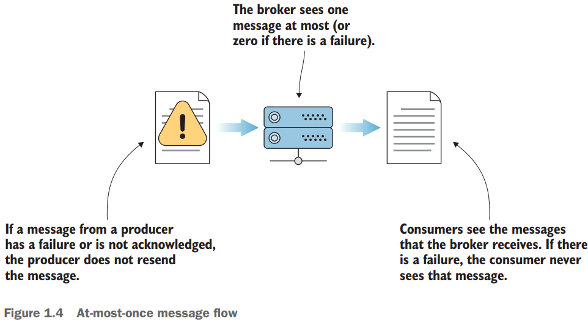

### Semántica Exactly-once (exactamente una vez)

Otra discusión que siguió al lanzamiento de EOS fue un debate sobre si exactamente una vez era posible. Aunque esto entra en la teoría de la informática más profunda, es útil ser consciente de cómo Kafka define su función EOS [4]. Si un productor envía un mensaje más de una vez, sólo se entregará una vez al consumidor final. EOS tiene puntos de contacto en todas las capas de Kafka: productores, temas, corredores y consumidores.

Además de las diversas opciones de entrega, **otra ventaja habitual del gestor de mensajes es que, si la aplicación consumidora está inactiva por errores o mantenimiento, el productor no necesita esperar a que el consumidor gestione el mensaje. Cuando los consumidores vuelvan a estar en línea y procesen los datos, podrán continuar donde lo dejaron y no dejarán caer ningún mensaje.**

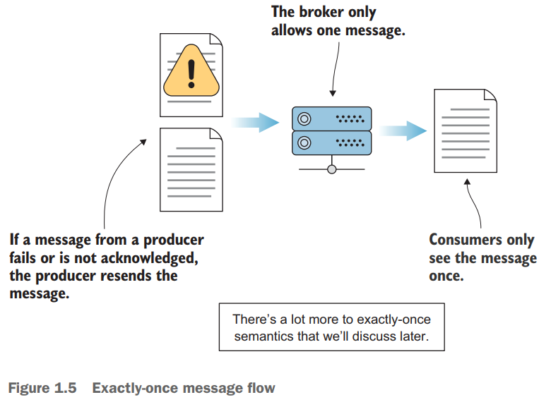

---

# [Pág. 17] Conociendo Kafka

`Apache Kafka` **es en el fondo un sistema distribuido, pero también es posible instalarlo y ejecutarlo en un único host.** Eso nos da un punto de partida para sumergirnos en nuestros casos de uso de ejemplo. Como suele ser el caso, las preguntas reales comienzan a fluir una vez que las manos tocan el teclado. **Al final de este capítulo, serás capaz de enviar y recuperar tu primer mensaje Kafka desde la línea de comandos.** Empecemos con Kafka y luego dediquemos un poco más de tiempo a profundizar en los detalles arquitectónicos de Kafka.


## [Por Martín] Instalando Apache Kafka

Para continuar con la explicación y ejemplos de este libro, instalaré `Apache Kafka` en mi pc local, aunque también lo tengo en Docker, pero trabajaré en mi pc local.
Entonces, para evitar repetir la documentación, mostraré a continuación repositorios donde ya he documentado cómo instalar `Apache Kakfa` en mi pc de windows así como agregado otros temas relacionados como el crear `topics`, listarlos, etc.

- [Un programador nace (youtube) - Spring Boot con Apache Kafka - Guía completa #spring #kafka](https://github.com/magadiflo/spring-boot-for-apache-kafka)
- [Bouali Ali (youtube) Apache Kafka Tutorial with Spring Boot Reactive & WebFlux | Kafka Tutorial](https://github.com/magadiflo/spring-boot-apache-kafka)
- [Amigoscode (youtube) - Kafka Tutorial - Spring Boot Microservices](https://github.com/magadiflo/spring-boot-kafka)
- Usando Kafka en Docker: [Uncle Dave's Code (youtube) - Creando una Aplicación Escalable - Microservicios con Spring Boot](https://github.com/magadiflo/microservices)

En mi caso, realicé los pasos descritos en los enlaces anteriores e instalé `kafka_2.13-3.7.0`. Para levantar Kafka hay que ejecutar los siguientes servidores en el siguiente orden:

1. **Iniciando servidor ZooKeeper**

```bash
C:\kafka_2.13-3.7.0
$ .\bin\windows\zookeeper-server-start.bat .\config\zookeeper.properties

[2024-04-22 11:43:57,405] INFO Reading configuration from: .\config\zookeeper.properties (org.apache.zookeeper.server.quorum.QuorumPeerConfig)
[2024-04-22 11:43:57,421] WARN C:kafka_2.13-3.7.0zookeeper is relative. Prepend .\ to indicate that you're sure! (org.apache.zookeeper.server.quorum.QuorumPeerConfig)
...
[2024-04-22 11:43:57,436] INFO Reading configuration from: .\config\zookeeper.properties (org.apache.zookeeper.server.quorum.QuorumPeerConfig)
...
[2024-04-22 11:43:57,436] INFO clientPortAddress is 0.0.0.0:2181 (org.apache.zookeeper.server.quorum.QuorumPeerConfig)
...
[2024-04-22 11:43:57,436] INFO Starting server (org.apache.zookeeper.server.ZooKeeperServerMain)
...
[2024-04-22 11:43:57,499] INFO  (org.apache.zookeeper.server.ZooKeeperServer)
[2024-04-22 11:43:57,499] INFO   ______                  _                                           (org.apache.zookeeper.server.ZooKeeperServer)
[2024-04-22 11:43:57,499] INFO  |___  /                 | |                                          (org.apache.zookeeper.server.ZooKeeperServer)
[2024-04-22 11:43:57,499] INFO     / /    ___     ___   | | __   ___    ___   _ __     ___   _ __    (org.apache.zookeeper.server.ZooKeeperServer)
[2024-04-22 11:43:57,499] INFO    / /    / _ \   / _ \  | |/ /  / _ \  / _ \ | '_ \   / _ \ | '__| (org.apache.zookeeper.server.ZooKeeperServer)
[2024-04-22 11:43:57,499] INFO   / /__  | (_) | | (_) | |   <  |  __/ |  __/ | |_) | |  __/ | |     (org.apache.zookeeper.server.ZooKeeperServer)
[2024-04-22 11:43:57,499] INFO  /_____|  \___/   \___/  |_|\_\  \___|  \___| | .__/   \___| |_| (org.apache.zookeeper.server.ZooKeeperServer)
[2024-04-22 11:43:57,499] INFO                                               | |                      (org.apache.zookeeper.server.ZooKeeperServer)
[2024-04-22 11:43:57,499] INFO                                               |_|                      (org.apache.zookeeper.server.ZooKeeperServer)
[2024-04-22 11:43:57,499] INFO  (org.apache.zookeeper.server.ZooKeeperServer)
[2024-04-22 11:43:57,499] INFO Server environment:zookeeper.version=3.8.3-6ad6d364c7c0bcf0de452d54ebefa3058098ab56, built on 2023-10-05 10:34 UTC (org.apache.zookeeper.server.ZooKeeperServer)
[2024-04-22 11:43:57,499] INFO Server environment:host.name=DESKTOP-EGDL8Q6 (org.apache.zookeeper.server.ZooKeeperServer)
[2024-04-22 11:43:57,499] INFO Server environment:java.version=21.0.1 (org.apache.zookeeper.server.ZooKeeperServer)
...
[2024-04-22 11:44:31,129] INFO Creating new log file: log.1 (org.apache.zookeeper.server.persistence.FileTxnLog)
```

2. **Iniciando el servidor de Kafka**

```bash

C:\kafka_2.13-3.7.0
$ .\bin\windows\kafka-server-start.bat .\config\server.properties

[2024-04-22 11:44:30,267] INFO Registered kafka:type=kafka.Log4jController MBean (kafka.utils.Log4jControllerRegistration$)
[2024-04-22 11:44:30,791] INFO Setting -D jdk.tls.rejectClientInitiatedRenegotiation=true to disable client-initiated TLS renegotiation (org.apache.zookeeper.common.X509Util)
[2024-04-22 11:44:30,941] INFO starting (kafka.server.KafkaServer)
[2024-04-22 11:44:30,971] INFO Connecting to zookeeper on localhost:2181 (kafka.server.KafkaServer)
[2024-04-22 11:44:30,997] INFO [ZooKeeperClient Kafka server] Initializing a new session to localhost:2181. (kafka.zookeeper.ZooKeeperClient)
[2024-04-22 11:44:31,005] INFO Client environment:zookeeper.version=3.8.3-6ad6d364c7c0bcf0de452d54ebefa3058098ab56, built on 2023-10-05 10:34 UTC (org.apache.zookeeper.ZooKeeper)
[2024-04-22 11:44:31,006] INFO Client environment:host.name=DESKTOP-EGDL8Q6 (org.apache.zookeeper.ZooKeeper)
[2024-04-22 11:44:31,006] INFO Client environment:java.version=21.0.1 (org.apache.zookeeper.ZooKeeper)
[2024-04-22 11:44:31,006] INFO Client environment:java.vendor=Oracle Corporation (org.apache.zookeeper.ZooKeeper)
[2024-04-22 11:44:31,007] INFO Client environment:java.home=C:\Program Files\Java\jdk-21.0.1 (org.apache.zookeeper.ZooKeeper)
[2024-04-22 11:44:31,007] INFO Client environment:java.class.path=C:\kafka_2.13-3.7.0\libs\activation-1.1.1.jar;C:\kafka_2.13-3.7.0\libs\aopalliance-repackaged-2.6.1.jar;C:\kafka_2.13-3.7.
...
[2024-04-22 11:44:31,026] INFO Initiating client connection, connectString=localhost:2181 sessionTimeout=18000 watcher=kafka.zookeeper.ZooKeeperClient$ZooKeeperClientWatcher$@6853425f (org.apache.zookeeper.ZooKeeper)
[2024-04-22 11:44:31,091] INFO jute.maxbuffer value is 4194304 Bytes (org.apache.zookeeper.ClientCnxnSocket)
[2024-04-22 11:44:31,101] INFO zookeeper.request.timeout value is 0. feature enabled=false (org.apache.zookeeper.ClientCnxn)
[2024-04-22 11:44:31,103] INFO [ZooKeeperClient Kafka server] Waiting until connected. (kafka.zookeeper.ZooKeeperClient)
[2024-04-22 11:44:31,106] INFO Opening socket connection to server localhost/[0:0:0:0:0:0:0:1]:2181. (org.apache.zookeeper.ClientCnxn)
[2024-04-22 11:44:31,111] INFO Socket connection established, initiating session, client: /[0:0:0:0:0:0:0:1]:55005, server: localhost/[0:0:0:0:0:0:0:1]:2181 (org.apache.zookeeper.ClientCnxn)
[2024-04-22 11:44:31,152] INFO Session establishment complete on server localhost/[0:0:0:0:0:0:0:1]:2181, session id = 0x100043444460000, negotiated timeout = 18000 (org.apache.zookeeper.ClientCnxn)
[2024-04-22 11:44:31,158] INFO [ZooKeeperClient Kafka server] Connected. (kafka.zookeeper.ZooKeeperClient)
[2024-04-22 11:44:31,657] INFO Cluster ID = hZojiwZcQFOnOr91RdDagA (kafka.server.KafkaServer)
...
[2024-04-22 11:44:33,393] INFO [KafkaServer id=0] started (kafka.server.KafkaServer)
[2024-04-22 11:44:33,994] INFO [zk-broker-0-to-controller-alter-partition-channel-manager]: Recorded new controller, from now on will use node DESKTOP-EGDL8Q6:9092 (id: 0 rack: null) (kafka.server.NodeToControllerRequestThread)
[2024-04-22 11:44:34,008] INFO [zk-broker-0-to-controller-forwarding-channel-manager]: Recorded new controller, from now on will use node DESKTOP-EGDL8Q6:9092 (id: 0 rack: null) (kafka.server.NodeToControllerRequestThread)
```


## [Pág. 18] Producir y consumir un mensaje

Un mensaje `(message)`, también llamado registro `(record)`, es el dato básico que fluye a través de Kafka. **Los mensajes son la forma en que Kafka representa sus datos.** Cada mensaje tiene: 

- Una marca de tiempo, 
- Un valor y
- Una clave opcional. 

También se pueden utilizar encabezados personalizados si se desea. Un ejemplo simple de un mensaje podría ser algo como lo siguiente:

> La máquina con ID de host "1234567" `(una clave de mensaje)` falló con el mensaje "Alerta: Falló la máquina" `(un valor de mensaje)` en "2020-10-02T10:34 :11.654Z” `(una marca de tiempo del mensaje)`. 

El Capítulo 9 muestra un ejemplo del uso de un encabezado personalizado para establecer un par `clave-valor` para un caso de uso de seguimiento.

La figura 2.1 muestra probablemente las partes más importantes y comunes de un mensaje con las que los usuarios tratan directamente. Cada `clave` y `valor` puede interactuar de formas específicas para serializar o deserializar sus datos.

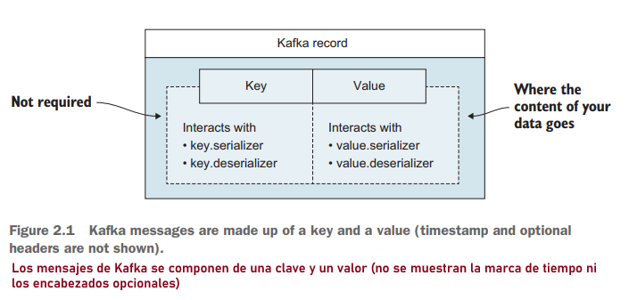

Ahora que tenemos un registro `(record)`, **¿cómo se lo hacemos saber a Kafka?** Entregará este mensaje a Kafka enviándolo a los conocidos como intermediarios `(brokers)`.

## [Pág. 18] ¿Qué son los brokers (intermediarios)?

Según el canal de youtube [Confluent](https://www.youtube.com/watch?v=jHnyBSUVcOU&list=PLa7VYi0yPIH0KbnJQcMv5N9iW8HkZHztH&index=7), se menciona que Kafka es un sistema distribuido. No obstante, habla sobre **¿Qué son los brokers?:**

- Desde el punto de vista de la infraestructura física, kafka está compuesto por una red de máquinas llamadas `brokers`. 
- En un despliegue contemporáneo es posible que estos no sean servidores físicos separados, por supuesto, estas podrían ser instancias en la nube o contenedores que se ejecutan en pods, en servidores virtualizados, en procesos reales en un centro de datos físico en algún lugar. Pero, sin importar cómo se implementen, ya sea que sean así o sean piezas físicas, son máquinas independientes cada uno ejecutando procesos del broker de kafka. 
- Cada broker aloja un conjunto de particiones de Kafka y maneja solicitudes entrantes para escribir nuevos eventos a esas particiones o leer eventos de ellas.
- Los `brokers` también se encargan de la replicación de particiones entre sí.
- Los `brokers` no hacen mucho, se mantienen intencionalmente muy simples y esa es una prioridad de diseño clave.

Continuando con el libro:

> Se puede considerar a los brokers como el lado del servidor de Kafka. 

Antes de las máquinas virtuales y Kubernetes, es posible que hayas visto un servidor físico alojando un broker. Dado que casi todos los clústeres tienen más de un servidor (o nodo), tendremos tres servidores Kafka en ejecución para la mayoría de nuestros ejemplos. Esta configuración de prueba local debería permitirnos ver la salida de comandos contra más de un corredor, que será similar a la ejecución con múltiples corredores a través de diferentes máquinas.

## Creando un topic

**Para nuestro primer ejemplo**, crearemos un `topic` y enviaremos nuestro primer mensaje a Kafka desde la línea de comandos. Una cosa a tener en cuenta es que `Kafka` fue construido con la línea de comandos en mente. No hay interfaz gráfica de usuario que vayamos a utilizar, por lo que necesitamos tener una forma de interactuar con la interfaz de línea de comandos del sistema operativo. **Los comandos se introducen en un prompt basado en texto.**

Para enviar nuestro primer mensaje, necesitaremos un lugar al que enviarlo. **Para crear un topic,** ejecutaremos el comando `kafka-topics.sh` en una ventana del shell con la opción `--create` (listado 2.1). Encontrarás este script en el directorio de instalación de Kafka, donde la ruta puede tener este aspecto `~/kafka_2.13-2.7.1/bin`. 

Tenga en cuenta que los usuarios de `Windows` pueden utilizar los archivos `.bat` con el mismo nombre que el equivalente en `shell`. Por ejemplo, `kafka-topics.sh` tiene el script equivalente para Windows llamado `kafka-topics.bat`, que debería estar ubicado en el directorio `<kafka_install_directory>/bin/windows`.

Teniendo levantado el servidor de `zookiper` y de `kafka` creamos nuestro primer topic:

1. **Así se vería el topic `kinaction-helloworld` con particiones y factor de replicación por defecto:**

```bash
C:\kafka_2.13-3.7.0

# Creando el topic llamado kinaction-helloworld
$ .\bin\windows\kafka-topics.bat --create --topic kinaction-helloworld --bootstrap-server localhost:9092
Created topic kinaction-helloworld.

# Listando los topics, únicamente tenemos el que acabamos de crear
$ .\bin\windows\kafka-topics.bat --list --bootstrap-server localhost:9092
kinaction-helloworld

# Describimos los detalles el topic kinaction-helloworld
$ .\bin\windows\kafka-topics.bat --describe --topic kinaction-helloworld --bootstrap-server localhost:9092
Topic: kinaction-helloworld     TopicId: GNM1FPcARdajN88jfinFbA PartitionCount: 1       ReplicationFactor: 1    Configs:
        Topic: kinaction-helloworld     Partition: 0    Leader: 0       Replicas: 0     Isr: 0
```

2. **Así se vería el topic `kinaction-helloworld` si lo creamos con 3 particiones y factor de replicación por defecto:**

En mi caso, crearé este topic con 3 particiones para avanzar con el libro y sus ejemplos.

```bash
C:\kafka_2.13-3.7.0

# Creando el topic llamado kinaction-helloworld con 3 particiones y por defecto el replication-factor será 1
$ .\bin\windows\kafka-topics.bat --create --topic kinaction-helloworld --partitions 3 --bootstrap-server localhost:9092
Created topic kinaction-helloworld.

# Listando los topics, únicamente tenemos el que acabamos de crear
$ .\bin\windows\kafka-topics.bat --list --bootstrap-server localhost:9092
kinaction-helloworld

# Describimos los detalles el topic kinaction-helloworld. Observamos las tres particiones creadas.
$ .\bin\windows\kafka-topics.bat --describe --topic kinaction-helloworld --bootstrap-server localhost:9092
Topic: kinaction-helloworld     TopicId: bUHbqDFnTB6rSw5BbMpd6w PartitionCount: 3       ReplicationFactor: 1    Configs:
        Topic: kinaction-helloworld     Partition: 0    Leader: 0       Replicas: 0     Isr: 0
        Topic: kinaction-helloworld     Partition: 1    Leader: 0       Replicas: 0     Isr: 0
        Topic: kinaction-helloworld     Partition: 2    Leader: 0       Replicas: 0     Isr: 0
```

En el libro se muestra la creación del topic `kinaction-helloworld` con los mismos parámetros usados en el ejemplo anterior, excepto que en el libro sí se usa el parámetro `--replication-factor 3`.
 **En mi caso no lo uso, dado que tengo un único cluster de kafka en mi pc y si agrego el parámetro --replication-factor 3 kafka me va a mostrar un error.** 
 
Veamos ese ejemplo, voy a intentar crear un nuevo topic llamado `quickstart-events` con `--replication-factor 3`:

```bash
C:\kafka_2.13-3.7.0

## Creando topic llamado quickstart-events con --replication-factor 3
$ .\bin\windows\kafka-topics.bat --create --topic quickstart-events --partitions 3 --replication-factor 3 --bootstrap-server localhost:9092

Error while executing topic command : Replication factor: 3 larger than available brokers: 1.
[2024-04-22 13:03:24,153] ERROR org.apache.kafka.common.errors.InvalidReplicationFactorException: Replication factor: 3 larger than available brokers: 1.
 (org.apache.kafka.tools.TopicCommand)
``` 
 
 Otro punto muy importante es que el nombre del topic debe estar con `- (guión medio)`, ya que cuando lo creé con `_ (guión bajo)` me trajo errores.


A continuación se muestra el ejemplo del libro `Kafka in Action 2022`: 

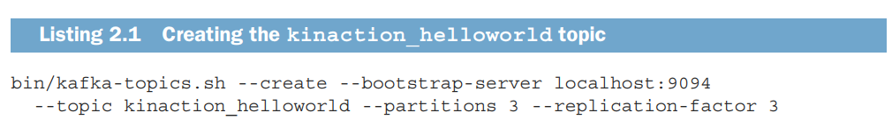

Hay un par de opciones más cuyo significado puede no estar claro todavía, pero para seguir avanzando con nuestra exploración, las definiremos rápidamente. Estos temas se tratarán con mayor detalle en el `capítulo 6.`

La opción `--partitions` determina en cuántas partes queremos que se divida el `topic`. *Por ejemplo, como tenemos tres `brokers` (está hablando el del libro, recordemos que en mi caso tengo un único broker), el uso de tres particiones nos da una partición por `broker`.* Para nuestras cargas de trabajo de prueba, es posible que no necesitemos tantas, basándonos únicamente en las necesidades de datos. Sin embargo, crear más de una partición en esta etapa nos permite ver cómo funciona el sistema al distribuir datos entre particiones. 

El `--replication-factor` también se establece en tres en este ejemplo. En esencia, esto dice que para cada partición queremos tener tres réplicas. Estas copias son una parte crucial de nuestro diseño para mejorar la confiabilidad y la tolerancia a fallas. 

La opción `--bootstrap-server` apunta a nuestro `broker Kafka local`. Es por eso que el `broker` debería estar ejecutándose antes de invocar este script. Para nuestro trabajo actual, el objetivo más importante es obtener una imagen del diseño. Analizaremos cómo estimar mejor los números que necesitamos en otros casos de uso cuando entremos en los detalles del `broker` más adelante.

## Listando topics

También podemos ver todos los temas existentes que se han creado y asegurarnos de que el nuevo esté en la lista. La opción `--list` es lo que podemos utilizar para lograr este resultado. Nuevamente, ejecutamos el siguiente comando en la ventana de terminal.

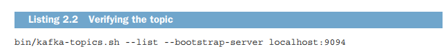

**NOTA**
> La imagen anterior es el ejemplo del libro, para mi caso particular donde estoy trabajando con un solo broker, ya hemostrado el `list` en el apartado de `Creando un topic`.

## Describiendo topic

Para tener una idea de cómo se ve nuestro nuevo `topic`, el listado 2.3 muestra otro comando que podemos ejecutar para darnos un poco más de información sobre nuestro clúster. Tenga en cuenta que nuestro tema no es como un tema único tradicional en otros sistemas de mensajería: tenemos réplicas y particiones. Los números que vemos junto a las etiquetas de los campos Líder, Réplicas e Isr son los broker.ids que corresponden al valor de nuestros tres brokers que configuramos en nuestros archivos de configuración. Al observar brevemente el resultado, podemos ver que nuestro tema consta de tres particiones: Partición 0, Partición 1 y Partición 2. Cada partición se replicó tres veces como pretendíamos en la creación del tema.

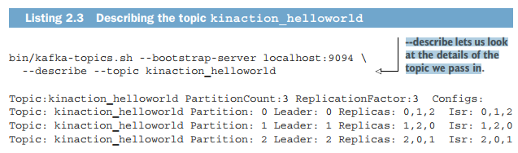

**NOTA**
> La imagen anterior es el ejemplo del libro, para mi caso particular donde estoy trabajando con un solo broker, ya hemostrado el `describe` en el apartado de `Creando un topic`.

El resultado del `listado 2.3` muestra en la primera línea una vista rápida de datos del recuento total de particiones y réplicas que tiene este `topic`. Las siguientes líneas muestran cada partición del `topic`. La segunda línea de salida es específica de la partición etiquetada como 0 y así sucesivamente. Acerquémonos a la partición 0, que tiene su líder de copia de réplica en el `broker 0`. Esta partición también tiene réplicas que existen en los `brokers 1 y 2`. La última columna, `Isr`, representa réplicas sincronizadas. Las réplicas sincronizadas muestran qué `brokers` están actualizados y no van a la zaga del líder. **Es fundamental recordar que el estado de las réplicas en un sistema distribuido es algo que queremos vigilar.** 

La Figura 2.2 muestra una vista si observamos el `broker con ID 0`.

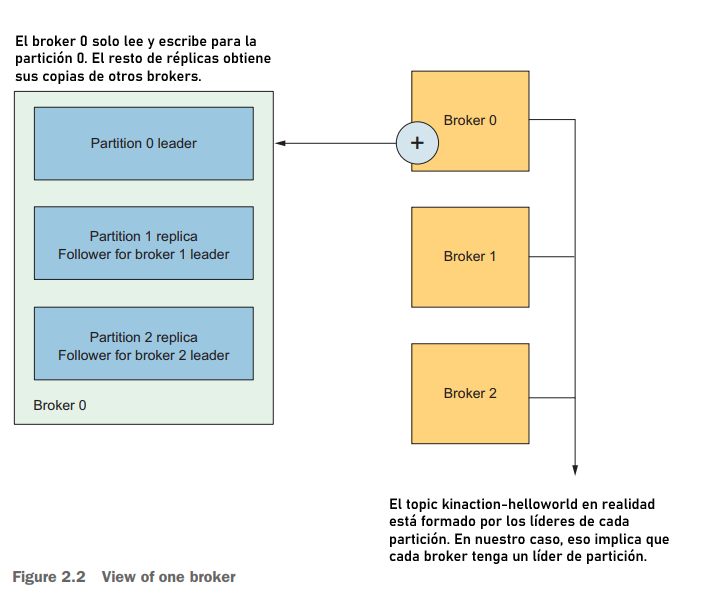

Para nuestro `topic` `kinaction_helloworld`, observe cómo el `broker 0` contiene la réplica líder para la partición 0. También contiene copias de réplica para las particiones 1 y 2 para las cuales no es la réplica líder. En el caso de su copia de la partición 1, los datos de esta réplica se copiarán del `broker 1`.

**NOTA**
> Cuando hacemos referencia a un líder de partición en la imagen, nos referimos a un líder de réplica. Es importante saber que una partición puede constar de una o más réplicas, pero solo una réplica será líder. El papel de un líder implica ser actualizado por clientes externos, mientras que los no líderes reciben actualizaciones sólo de su líder.

## Kafka producer: escribiendo mensajes

Ahora, una vez que hayamos creado nuestro `topic` y verificado que existe, **¡podemos comenzar a enviar mensajes reales!** 

Aquellos que hayan trabajado antes con Kafka podrían preguntar por qué tomamos el paso anterior para crear el `topic` antes de enviar un mensaje. Existe una configuración para habilitar o deshabilitar la creación automática de `topics`. Sin embargo, generalmente **es mejor controlar la creación de `topics` como una acción específica porque no queremos que aparezcan nuevos `topics` aleatoriamente si alguien escribe mal el nombre de un `topic` una o dos veces o que se vuelvan a crear debido a reintentos del productor.**

Un cliente de Kafka se comunica con los brokers de Kafka a través de la red para escribir (o leer) eventos. Una vez recibidos, los brokers almacenarán los eventos de forma duradera y tolerante a fallos durante el tiempo que sea necesario, incluso para siempre.

Ejecute el cliente `producer` de consola para escribir algunos eventos en su `topic` llamado `kinaction-helloworld`. De forma predeterminada, cada línea que ingrese dará como resultado que se escriba un evento separado en el `topic`.

```bash
C:\kafka_2.13-3.7.0

$ .\bin\windows\kafka-console-producer.bat --topic kinaction-helloworld --bootstrap-server localhost:9092
>Este es mi primer evento
>Este es mi segundo evento
>
```

## Kafka consumer: leyendo eventos (mensajes)

Abra otra terminal y ejecute el cliente `consumer` de consola para leer los eventos (mensajes) que acaba de crear:

```bash
C:\kafka_2.13-3.7.0

$ .\bin\windows\kafka-console-consumer.bat --topic kinaction-helloworld --from-beginning --bootstrap-server localhost:9092
Este es mi primer evento
Este es mi segundo evento
```

**NOTA**
> - La bandera `--from-beginning` indica que el consumidor leerá los mensajes desde el inicio del `topic`, en lugar de comenzar desde el offset actual.
> - Puede detener el cliente consumidor con `Ctrl-C` en cualquier momento.

Siéntase libre de experimentar: por ejemplo, vuelva a su terminal de productor (paso anterior) para escribir eventos adicionales y vea cómo los eventos aparecen inmediatamente en su terminal de consumidor.

Debido a que los eventos se almacenan de forma duradera en Kafka, pueden ser leídos tantas veces y por tantos consumidores como desee. Puede verificar esto fácilmente abriendo otra sesión de terminal y volviendo a ejecutar el comando anterior.

## [Pág. 23] Tour por Kafka

**La siguiente tabla muestra los componentes principales y sus funciones dentro de la arquitectura Kafka.** En las siguientes secciones, profundizaremos más en cada uno de estos elementos para obtener una base sólida para los siguientes capítulos.

| Component             | Role                                                                  |
|-----------------------|-----------------------------------------------------------------------|
| Producer              | Envía messages a Kafka                                                |
| Consumer              | Recupera messages desde Kafka                                         |
| Topics                | Nombre lógico de donde se almacenan los mensajes en el broker         |
| ZooKeeper ensemble    | Ayuda a mantener el consenso en el cluster                            |
| Broker                | Maneja el commit log (cómo se almacenan los mensajes en el disco)     |

## [Pág. 23] Producers y consumers

**Un `producer` es una herramienta para enviar mensajes a temas de Kafka.** Como mencionamos en nuestros casos de uso en el capítulo 1, un buen ejemplo es un archivo de log que se genera a partir de una aplicación. Esos archivos no forman parte del sistema Kafka hasta que se recopilan y envían a Kafka. Cuando piensas en entradas (o datos) que entran en Kafka, estás viendo a un poducer involucrado en algún lugar interno.

**Un `consumer` es una herramienta para recuperar mensajes de Kafka.** En la misma línea que los productores, si hablamos de obtener datos de Kafka, consideramos que los consumidores participan directa o indirectamente. 
Las aplicaciones consumidoras se suscriben a los `topics` que les interesan y solicitan datos continuamente. 

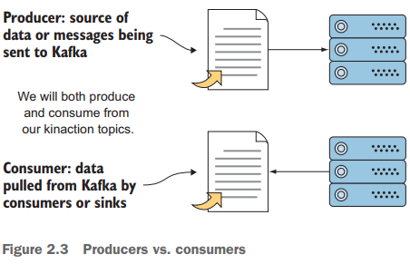

## [Pág. 26] Descripción general de los Topics

Los `topics` son donde la mayoría de los usuarios empiezan a pensar en la lógica de qué mensajes deben ir y dónde. Los `topics` constan de unidades llamadas `particiones`. **En otras palabras, una o más `particiones` pueden formar un solo `topic`.** En cuanto a lo que realmente se implementa en el disco de la computadora, las `particiones` son con lo que Kafka trabaja en su mayor parte.

**NOTA:**
> Una réplica de partición individual solo existe en un solo broker y no puede dividirse entre brokers.

La Figura 2.6 muestra cómo cada líder de réplica de partición existe en un único broker de Kafka y no puede dividirse en partes más pequeñas que esa unidad. Piensa en nuestro primer ejemplo, el `topic` `kinaction_helloworld`. Si estás buscando confiabilidad y quieres tres copias de los datos, el `topic` en sí no es una sola entidad (o un solo archivo) que se copia; en cambio, son las diferentes particiones las que se replican tres veces cada una.

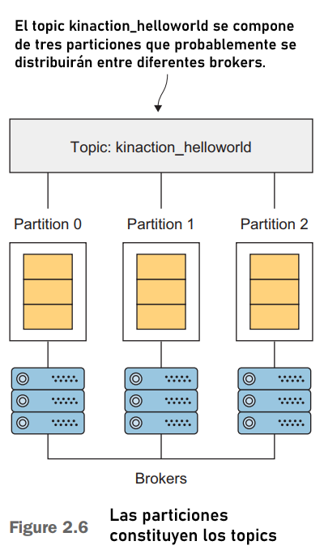

Uno de los conceptos más importantes que debemos comprender en este punto es la idea de que una de las copias de la partición (réplicas) será lo que se conoce como `líder`. *Por ejemplo, si tiene un tema compuesto por tres particiones y un total de tres copias de cada partición, cada partición tendrá una réplica líder elegida. Ese líder será una de las copias de la partición, y los otros dos (en este caso, no mostrados en la figura 2.6) serán seguidores, que actualizan su información desde su réplica líder de partición.*

`Los productores y consumidores` **solo leen o escriben desde la `réplica líder` de cada partición a la que está asignada durante escenarios donde no hay excepciones ni fallas (también conocido como escenario de "camino feliz").** Pero, *¿cómo sabe su productor o consumidor qué réplica de partición es la líder?* En el caso de computación distribuida y fallas aleatorias, esa respuesta a menudo se ve influenciada por la ayuda de `ZooKeeper`, la siguiente parada de nuestro recorrido.

## [Pág. 27] Uso de ZooKeeper

Una de las fuentes más antiguas de la temida complejidad adicional en el ecosistema Kafka podría ser que utiliza ZooKeeper. `Apache ZooKeeper` **es una tienda distribuida que proporciona servicios de descubrimiento, configuración y sincronización de forma altamente disponible.**

En las versiones de Kafka desde la 0.9, se realizaron cambios en ZooKeeper que permitieron que un consumidor tuviera la opción de no almacenar información sobre hasta qué punto había consumido mensajes (llamados compensaciones). Cubriremos la importancia de las compensaciones en capítulos posteriores. Sin embargo, este uso reducido no eliminó la necesidad de consenso y coordinación en los sistemas distribuidos.

Como ya vio, nuestro clúster para Kafka incluye más de un broker (servidor). Para actuar como una aplicación correcta, estos brokers no sólo deben comunicarse entre sí, sino que también deben llegar a un acuerdo. Acordar cuál es la réplica líder de una partición es un ejemplo de la aplicación práctica de ZooKeeper dentro del ecosistema Kafka.

Una cosa a tener en cuenta para cualquier caso de uso de producción es que `ZooKeeper` será un conjunto, pero ejecutaremos solo un servidor en nuestra configuración local. La Figura 2.7 muestra el clúster `ZooKeeper` y cómo es la interacción de Kafka con los `brokers` y no con los clientes. KIP-500 se refiere a este uso como el diseño de clúster "actual".

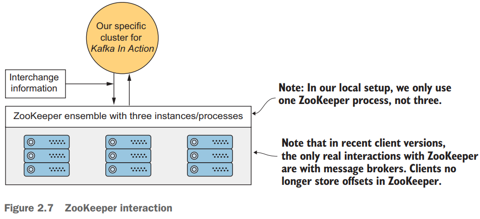

## [Pág. 28] La arquitectura de Kafka a alto nivel

En general, se puede considerar el núcleo de Kafka como procesos de aplicación Scala que se ejecutan en una máquina virtual Java (JVM). Aunque destaca por ser capaz de manejar millones de mensajes rápidamente, **¿qué tiene el diseño de Kafka que lo hace posible?** Una de las claves de Kafka es el uso de la caché de páginas del sistema operativo *(como se muestra en la figura 2.8).* Al evitar el almacenamiento en caché en la pila de JVM, los brokers pueden ayudar a prevenir algunos de los problemas que pueden tener las pilas grandes (por ejemplo, pausas largas o frecuentes en la recolección de basura) [6].

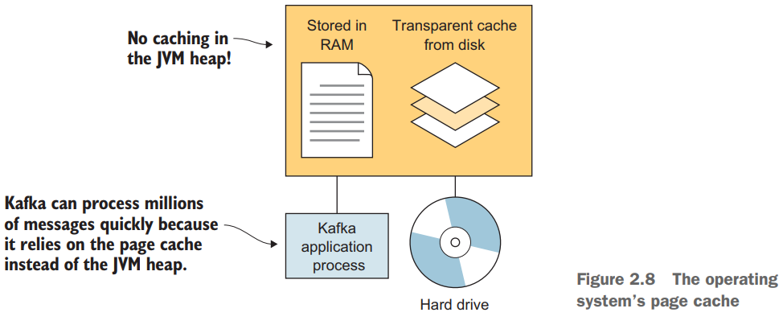

Kafka utiliza su propio protocolo. Los creadores de Kafka señalaron que el uso de un protocolo existente como **AMQP (Advanced Message Queuing Protocol - Protocolo avanzado de cola de mensajes)** tenía un papel demasiado importante en los impactos en la implementación real. Por ejemplo, se agregaron nuevos campos al encabezado del mensaje para implementar la semántica **exactamente una vez** de la versión 0.11. Además, esa misma versión modificó el formato de los mensajes para comprimirlos de manera más efectiva. 

